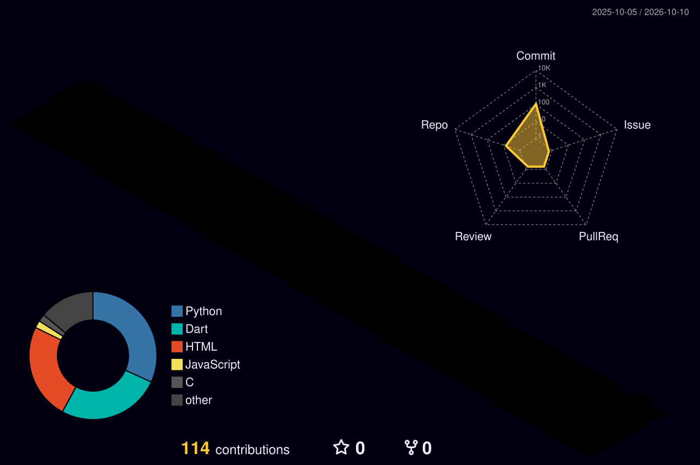

### Hi there, I'm Anivesh Gupta 👋

---

## 💫 About Me

- 🎓 Final-year **B.Tech CSE @ VIT Vellore (2023 – 2027)**
- 🔭 Currently building **Vaidyum** — an AI triage assistant for rural healthcare helplines, and **ATERN-DQD** — a probabilistic solar forecasting model targeting *IEEE Trans. on Power Systems*
- 🧠 I train ML models, write data pipelines, and ship full-stack web apps
- 🤟 Built a **36-class ASL sign language recognizer** — self-collected dataset (~7,200 samples), **92–96% accuracy**
- 🛠️ My stack: React · Node.js · Python · Java · SQL · FastAPI · Flutter
- 🌱 Also comfortable with embedded systems (8051, I2C, AVR flashing) and DSA
- ⚡ I pick up new tools fast and work independently across dev, data, or research roles
- 📫 Reach me: **aniveshgupta13579@gmail.com**
- 😄 Pronouns: he/him · 📍 Vellore, India

---

## 🌐 Socials

---

## 💻 Tech Stack

  

FastAPI · Hugging Face Transformers · MediaPipe · Google Gemini API · Oracle SQL · Gradle · VS Code · Figma

DSA · OOP · REST APIs · Machine Learning · NLP · Statistical Modelling · System Design · Microservices · Agile · Embedded C

---

## 🚀 Featured Projects

<table>
<tr>
<td width="50%">

### [🤌 Real-Time Sign Language Recognition](https://github.com/AniveshGuptaOfficial/Real-Time-Sign-Language-Recognition-System)
36-class ASL recognition built from scratch — ~7,200 self-collected samples, 42 MediaPipe hand-landmark features (translation & scale normalised), SVM with RBF kernel at **92–96% accuracy**. Shipped as a FastAPI web app with live webcam + TTS, plus a standalone OpenCV desktop app.

</td>
<td width="50%">

### [☀️ ATERN-DQD — Solar Power Forecasting](https://github.com/Pk-webTech/ATERNET)
Adaptive Temporal Expert Routing Network with Dynamic Quantile Decoding. Mixture-of-Experts backbone where each expert handles a different irradiance regime, with a quantile decoder emitting uncertainty intervals instead of point estimates. Ablations vs. LSTM and transformer baselines. Targeting *IEEE Trans. on Power Systems*.

</td>
</tr>
<tr>
<td width="50%">

### [🏥 Vaidyum — AI Triage for Rural Healthcare](https://github.com/AniveshGuptaOfficial/helpline-triage-nlp)
NLP classifier routes incoming health messages into **Emergency / Medicine Query / Appointment**, with a secondary distress-scoring pass before escalation. Each category hits a differently-prompted Google Gemini assistant. Flutter app for voice input, FastAPI routing backend.

</td>
<td width="50%">

### [♿ ARWMF — Web Accessibility Scoring](https://github.com/AniveshGuptaOfficial/ARWMF-Web-Accessibility-Scoring)
Python scoring framework for evaluating web accessibility, with an "Other" component bucket. Most recently updated repo.

</td>
</tr>
<tr>
<td width="50%">

### [🛒 VTrade — Campus Marketplace](https://github.com/AniveshGuptaOfficial/VTrade)
University e-commerce & delivery platform: students order essentials and earn by taking deliveries in their free periods. OTP login, cart, slot-based delivery; Node.js/Express backend.

</td>
<td width="50%">

### ♟️ Multiplayer Chess Game
Full chess rules in the browser — legal moves, check, checkmate, minimax AI opponent, and two-player over WebSockets.

</td>
</tr>
<tr>
<td width="50%">

### [📚 Books4MU — University Book Store](https://github.com/AniveshGuptaOfficial/Books-For-My-University)
Web store for finding course books by semester — cart, discounts up to 75%, newsletter.

</td>
<td width="50%">

### [🖥️ Portfolio Website](https://aniveshguptaofficial.github.io/PORTFOLIO/)
React SPA on Vercel with skill bars, projects, certifications and contact. 56+ commits and still being updated.

</td>
</tr>
</table>

---

## 🎓 Education & Certifications

| | |
|---|---|
| 🎓 **B.Tech, Computer Science & Engineering** — VIT Vellore | **2023 – 2027** |
| 📚 Coursework | DSA, Design & Analysis of Algorithms, DBMS, AI, NLP, Probability & Statistics, OS, Computer Networks, Software Engineering, Web Programming |

<b>📜 Certifications (click to expand)</b>

- 🟦 **Advanced Generative AI** — IBM Career Education Program *(Jul 2026)*
- 🟦 **Java Developer Professional Certificate** — IBM & Coursera *(Jun 2026)*
- 🟧 **Human Computer Interaction** — NPTEL *(Apr 2026)*
- 🟥 **AI Foundations Associate** — Oracle *(Sep 2025)*
- 🟩 **Data Science Bootcamp** — GeeksforGeeks *(Jul 2025)*
- 🟪 **Cybersecurity Job Simulation** — Deloitte & Forage *(Jun 2025)*
- 🟨 **DSA** — Infosys Springboard *(May 2025)*
- 🏆 **Yantra Central Hackathon** — VIT *(Feb 2025)*

<b>⚔️ Competitive Programming & Extras</b>

- Solving on **LeetCode** and **Codeforces** since 2025 — arrays, dynamic programming, graphs
- Completed **Advanced Competitive Coding I & II** at VIT
- 🗣️ Hindi (Native) · English (Professional) · Bengali (Conversational) · Spanish (Basic)
- 💡 Interests: Traveling · Photography · Exploring Cuisines · Movies · Music

---

## 🌌 My Tech Universe

---

## 🧊 3D Contribution Graph

---

## 📊 GitHub Stats

 

 

 

<!-- Visitor counter -->

---

### ✨ Thanks for stopping by! ✨

